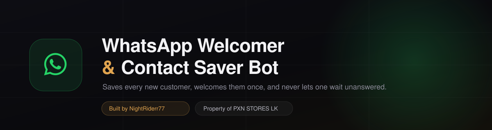
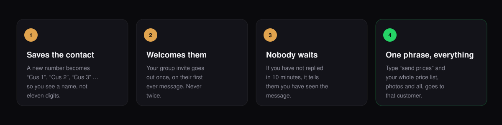
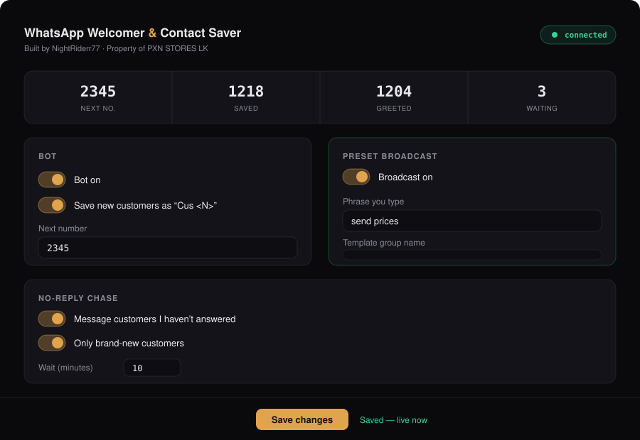

<div align="center">



**Built by [NightRiderr77](https://github.com/NightRiderr77) · Property of [PXN STORES LK](https://pxnstores.lk)**

</div>

---

## What this does



You run a shop on WhatsApp. All day, new numbers message you. This bot sits on
your own WhatsApp and handles the boring parts.

1. **Saves the customer.** Every new number gets saved to your phone as
   `Cus 1`, `Cus 2`, `Cus 3` and so on. No more walls of digits.
2. **Welcomes them once.** Your group invite goes out automatically on their
   first ever message. Never twice, never to someone you already have.
3. **Nobody is left waiting.** If you have not replied in 10 minutes, it tells
   them you have seen the message. You choose the wording and the wait.
4. **Sends your price list in one go.** Type one short phrase into a chat and
   the bot sends that customer everything from your template group — prices,
   photos, terms, in order.

It never answers customers for you. It has no AI. It only does the four things
above.

---

## What you need

| | |
|---|---|
| A **VPS** | A small server that stays on. 2 GB RAM or more. Ubuntu is fine. |
| A **phone number** | The WhatsApp number your shop uses. |
| **5 minutes** | That's the whole setup. |

> **2 GB RAM is not optional.** The bot runs a hidden web browser to talk to
> WhatsApp, and browsers are hungry. On less, WhatsApp will disconnect your
> phone every few minutes.

---

## Step 1 — Get into your server

On Windows use PowerShell, on Mac use Terminal. Type this, with your own server
address:

```bash
ssh ubuntu@YOUR-SERVER-IP
```

Everything below is typed into that window.

## Step 2 — Install Docker

Docker is the thing that runs the bot. Copy this whole line and press Enter:

```bash
curl -fsSL https://get.docker.com | sudo sh
```

Then let yourself use it without typing `sudo` every time:

```bash
sudo usermod -aG docker $USER && newgrp docker
```

Check it worked. You should see a version number:

```bash
docker --version
```

## Step 3 — Download the bot

```bash
git clone https://github.com/NightRiderr77/whatsapp-welcomer-and-contact-saver-bot.git ~/welcomer-bot
```

```bash
cd ~/welcomer-bot
```

## Step 4 — Set your password

This is the password for your control panel. Make it long.

```bash
cp .env.example .env && nano .env
```

Change `pick-something-long` to your own password. Then press
**Ctrl+X**, then **Y**, then **Enter** to save.

## Step 5 — Start it

```bash
docker compose up -d --build
```

The first time takes a few minutes. Then:

```bash
docker compose logs -f
```

A **QR code** appears in the window.

## Step 6 — Scan the QR

On your phone: **WhatsApp → Settings → Linked Devices → Link a Device**, then
point the camera at the QR code on your screen.

When you see `ready.` in the window, it is working. Press **Ctrl+C** to stop
watching the log — the bot keeps running.

---

## Your control panel



Open this in any browser, on your phone or your laptop:

```
http://YOUR-SERVER-IP:8091
```

Sign in with the password from Step 4. Everything you change here applies
**immediately** — no restarting.

### What each setting means

| Setting | What it does |
|---|---|
| **Bot on** | Turn everything off in one click. |
| **Save new customers** | Save new numbers as `Cus 1`, `Cus 2` … |
| **Next number** | The number the next customer gets. |
| **Group invite** | The welcome message sent on someone's first message. Leave it empty and nothing is sent. |
| **No-reply chase** | Message customers you haven't answered yet. |
| **Only brand-new customers** | Keep this **on**. Off means it will also chase people you have known for months. |
| **Wait (minutes)** | How long before it chases. |
| **Preset broadcast** | See below. |

> The four numbers at the top — **Next no. / Saved / Greeted / Waiting** — are
> your health check. If **Next no.** is stuck on `1`, something is wrong and a
> red box on the page will tell you what.

---

## Sending your price list with one phrase

This is the fastest way to answer "how much?".

**Set it up once:**

1. On WhatsApp, make a **group with only you in it**. Call it `forward-all`.
2. Post everything a new customer should get: price list, photos, terms.
   Order matters — it is sent in the same order.
3. In the control panel, turn on **Broadcast**, and set **Phrase you type** to
   something short like `send prices`.

**Then, forever after:** type `send prices` into any customer's chat. The bot
sends them the whole group. Capital letters and full stops don't matter.

Only messages **you** posted in the group get sent. Anything a member posted is
skipped.

---

## Everyday commands

Always `cd ~/welcomer-bot` first.

**See what it is doing**

```bash
docker compose logs -f
```

**Stop it**

```bash
docker compose stop
```

**Start it again**

```bash
docker compose start
```

**Restart it**

```bash
docker compose restart
```

**Is it running?**

```bash
docker compose ps
```

**Update to the newest version**

```bash
git pull && docker compose up -d --build
```

---

## Limiting how much of the server it uses

The bot already limits itself to **1 CPU core**. You can change that in
`docker-compose.yml`:

```bash
nano docker-compose.yml
```

Find `cpus: "1.0"`. Use `"0.5"` for half a core, `"2.0"` for two. Save with
**Ctrl+X**, **Y**, **Enter**, then:

```bash
docker compose up -d
```

> **Never add a memory limit.** There is a `memory:` setting you might be
> tempted to add — don't. The browser gets killed before the bot notices, the
> WhatsApp page reloads over and over, and eventually WhatsApp unlinks your
> phone. It looks like a login problem and it isn't.

**Check what it is actually using:**

```bash
docker stats --no-stream
```

---

## If it is using too much memory

Most of what the bot uses is not the bot — it is the browser holding your
WhatsApp. **The more chats on the account, the more it holds**, and it never
gives any of it back on its own.

The bot already handles this for you. Every 5 minutes it checks itself, and
it works out the right numbers from **the size of your server** — a bigger
server is simply allowed to use more:

| Your server | Cleans up above | Restarts above |
|---|---|---|
| 1 GB | 400 MB | 650 MB |
| 2 GB | 614 MB | 1024 MB |
| 4 GB | 1229 MB | 2048 MB |
| 6 GB or more | 1500 MB | 2500 MB |

The exact numbers it picked are printed when it starts:

```bash
cd ~/welcomer-bot && docker compose logs | grep "memory:"
```

A restart takes a few seconds and **you do not have to scan the QR again** —
the login is saved on the server. It never restarts in the middle of sending
someone your price list.

You can watch the number on your control panel: the **Memory** box turns
orange when it is cleaning up and red when it is about to restart.

> **Using 800 MB is not a problem.** What matters is the share of the server,
> not the number. Check it with `docker stats --no-stream` — if the **MEM %**
> column is comfortably under 50%, there is nothing to fix.

### Overruling it

Only if you want to. Open your settings file:

```bash
nano ~/welcomer-bot/.env
```

Add these two lines and pick your own numbers:

```
MEM_SOFT_MB=1500
MEM_HARD_MB=2500
```

Save with **Ctrl+X**, **Y**, **Enter**, then:

```bash
cd ~/welcomer-bot && docker compose up -d
```

### Give the server some swap

This is the single best thing you can do on a small VPS. It gives the server
spare room so a busy moment never kills anything. **Run this once:**

```bash
sudo fallocate -l 2G /swapfile && sudo chmod 600 /swapfile && sudo mkswap /swapfile && sudo swapon /swapfile && echo "/swapfile none swap sw 0 0" | sudo tee -a /etc/fstab
```

Check it worked:

```bash
free -h
```

### The rest of it is on your phone

The browser holds every chat your WhatsApp has. Deleting old customer chats
you no longer need — on the phone — is the only thing that makes the list
itself smaller. Archiving does not help; the chat is still there.

> **Still never add a `memory:` limit to `docker-compose.yml`.** The bot
> clearing memory early is safe. A limit kills the browser instead, and that
> ends with WhatsApp unlinking your phone.

---

## Sharing the server with 3x-ui (or anything else)

**Restarting the bot does not touch anything else on the server.** The bot
lives inside its own container. Your panel and your VPN run outside it, on the
server itself, and never see the bot start or stop. Nobody gets disconnected.

The only way the bot could ever affect them is by taking something they need —
memory, or the processor — so it is set up to lose that argument on purpose:

| If they compete for | What happens |
|---|---|
| The processor | Your VPN goes first, the bot waits |
| Memory | The bot is killed, never your VPN |

These only apply when there is a genuine shortage. On a normal day nothing is
competing and neither setting does anything.

**Add swap so it never comes to that.** One command, once:

```bash
sudo fallocate -l 2G /swapfile && sudo chmod 600 /swapfile && sudo mkswap /swapfile && sudo swapon /swapfile && echo "/swapfile none swap sw 0 0" | sudo tee -a /etc/fstab
```

### Check nothing wants the same port

The bot uses port **8091** for your control panel. Before you start it:

```bash
sudo ss -lntp | grep 8091
```

**No output is good** — nothing else is using it. If something answers, change
the left-hand number in `docker-compose.yml` (`"8091:8091"` to `"8092:8091"`)
and use that instead.

### Your control panel is open to the internet

Docker opens port 8091 to everyone, and it does this **underneath your
firewall** — a `ufw deny` rule will not stop it. Your password is the only
thing protecting it, so make that password long.

To close it off completely instead, edit `docker-compose.yml`:

```bash
nano ~/welcomer-bot/docker-compose.yml
```

Change `- "8091:8091"` to `- "127.0.0.1:8091:8091"`, save, then
`docker compose up -d`. The panel is now reachable only from the server
itself. To open it on your own computer, run this **on your computer** and
then visit `http://localhost:8091`:

```bash
ssh -L 8091:127.0.0.1:8091 root@YOUR-SERVER-IP
```

---

## Moving to another server

Three things must come with you, or you will be scanning a QR again and
inviting all your old customers a second time: the **WhatsApp login**, your
**settings and counter**, and the **list of who you have already saved**.

The two scripts do all of it.

**On the old server:**

```bash
cd ~/welcomer-bot && ./backup.sh
```

This stops the bot, packs everything into one file, and starts it again. You
get a file like `welcomer-bot-backup-2026-08-20-1243.tar.gz`.

Send it to the new server:

```bash
scp welcomer-bot-backup-*.tar.gz ubuntu@NEW-SERVER-IP:~/
```

> ⚠️ **That file is your WhatsApp login and your panel password.** Treat it like
> a password. Move it, use it, delete it.

**On the new server**, do Step 1, Step 2 and Step 3 above, then:

```bash
cd ~/welcomer-bot && mv ~/welcomer-bot-backup-*.tar.gz . && ./restore.sh welcomer-bot-backup-*.tar.gz
```

```bash
docker compose up -d --build && docker compose logs -f
```

You should see `ready.` and **no QR code**. If a QR appears, the login did not
come across.

**Then clean up.** Delete the backup file:

```bash
shred -u welcomer-bot-backup-*.tar.gz
```

And turn off the old one, so two bots aren't on one number:

```bash
cd ~/welcomer-bot && docker compose down    # on the OLD server
```

---

## Removing the bot completely

**Stop it and delete the container:**

```bash
cd ~/welcomer-bot && docker compose down
```

**Take a backup first if you might want it back:**

```bash
./backup.sh
```

**Delete everything, including your WhatsApp login and settings:**

```bash
cd ~ && rm -rf ~/welcomer-bot
```

> This cannot be undone. Your saved contacts stay on your phone, but the
> counter, the settings and the login are gone.

**Also unlink it from WhatsApp**, on your phone:
**Settings → Linked Devices**, tap the entry, **Log out**.

**Free the disk space Docker used:**

```bash
docker system prune -af
```

---

## When something goes wrong

**A QR code keeps appearing**

WhatsApp unlinked the device. Usually the server is short on memory — check
with `free -m`. You need 2 GB.

**Every customer is saved as `Cus 1`**

The bot cannot read its settings. Open the control panel — a red box at the top
says exactly why.

**`Failed to launch the browser process: Code: 21`**

An old lock from a previous run. The bot clears these itself on start; if it
persists:

```bash
cd ~/welcomer-bot && docker compose down && docker compose up -d --build
```

**The panel won't open**

Check the bot is running with `docker compose ps`, and that your server's
firewall allows port `8091`.

**`Permission denied` when running a script**

```bash
bash backup.sh
```

Works whether or not the file is marked executable.

---

## Where things are kept

| File | What's in it |
|---|---|
| `state/settings.json` | All your settings and the customer counter. |
| `state/saved-contacts.json` | Who has been saved already. |
| `state/greeted.json` | Who has had the welcome message. |
| `.wwebjs_auth/` | Your WhatsApp login. |
| `.env` | Your control panel password. |

None of these are in the repository, and none should ever be shared.

---

## Running without Docker

If you prefer PM2:

```bash
npm install && npm install -g pm2
```

```bash
DASH_PASSWORD=your-password pm2 start ecosystem.config.js && pm2 save
```

```bash
pm2 logs welcomer-bot
```

---

<div align="center">

### WhatsApp Welcomer &amp; Contact Saver Bot

Built by **[NightRiderr77](https://github.com/NightRiderr77)**

Property of **[PXN STORES LK](https://pxnstores.lk)** · [pxnstores.lk](https://pxnstores.lk)

</div>
